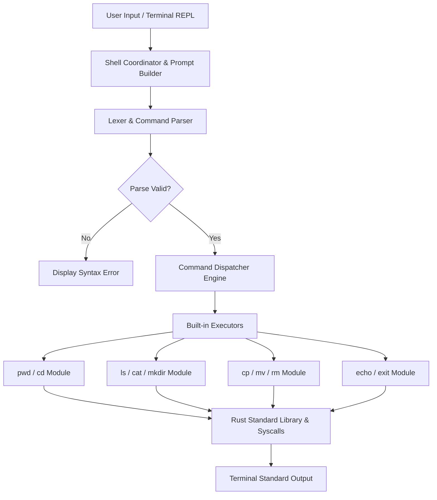
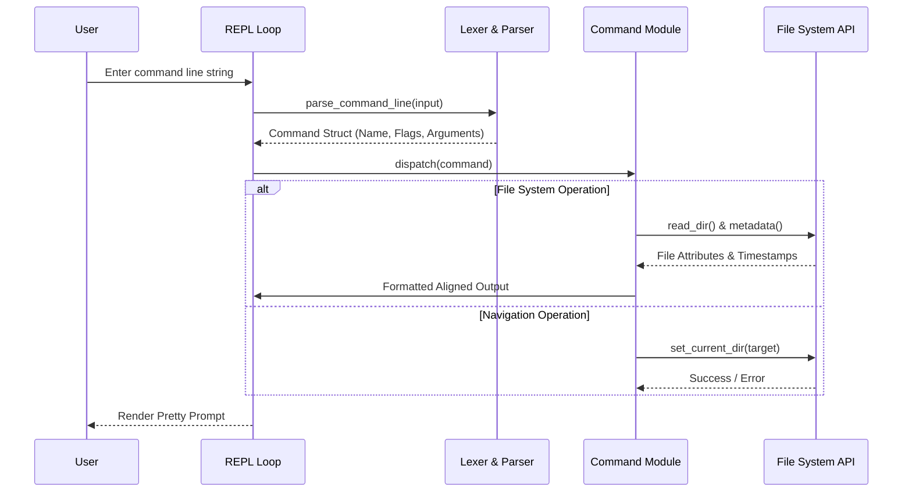

# 🐚 OxideShell

[](https://www.rust-lang.org/)
[](LICENSE.md)
[](#-setup--execution)

A minimalist, high-performance Unix-like command shell implemented entirely from scratch in Rust. 

OxideShell operates completely standalone—it does not rely on or spawn external system binaries (such as `/bin/ls` or `/bin/cp`). Instead, every command execution path is implemented directly via Rust standard library file system drivers and OS syscall abstractions.

---

## 💻 Terminal Preview

Here is an example of an interactive session running inside **OxideShell**:

```text
$ ./target/release/oxide-shell
~/projects ❯ pwd
/Users/sayed/projects

~/projects ❯ mkdir workspace && cd workspace
~/projects/workspace ❯ echo "Hello from OxideShell!" > note.txt
~/projects/workspace ❯ cat note.txt
Hello from OxideShell!

~/projects/workspace ❯ ls -l -a -F
drwxr-xr-x  3 sayed  staff    96 Sep 13 03:00 ./
drwxr-xr-x  4 sayed  staff   128 Sep 13 03:00 ../
-rw-r--r--  1 sayed  staff    23 Sep 13 03:00 note.txt

~/projects/workspace ❯ cp note.txt backup.txt
~/projects/workspace ❯ ls -F
backup.txt  note.txt

~/projects/workspace ❯ exit 0
```

---

## ⚡ Key Highlights

- **Zero External Binary Dependencies**: All shell commands (`ls`, `cp`, `mv`, `rm`, `cat`, etc.) execute internally within the process memory space.
- **Robust Argument & Quote Parser**: Implements state-machine parsing for single quotes (`'`), double quotes (`"`), and escape characters.
- **Pretty Environment Prompt**: Dynamic prompt formatting showing relative path representation (`~` substitution for home directory).
- **Signal Grace & Protection**: Built-in signal handling catches `Ctrl+C` (`SIGINT`) without terminating the active shell session.
- **Dynamic Table Alignment**: `ls -l` outputs are formatted using calculated column widths for user, group, byte sizes, and timestamps.

---

## 📋 Table of Contents

- [Terminal Preview](#-terminal-preview)
- [Key Highlights](#-key-highlights)
- [Supported Built-in Commands](#-supported-built-in-commands)
- [System Architecture](#-system-architecture)
- [Command Execution Flow](#-command-execution-flow)
- [Setup & Execution](#-setup--execution)
- [Directory Structure](#-directory-structure)
- [License](#-license)

---

## 🛠️ Supported Built-in Commands

| Command | Supported Flags | Description |
| :--- | :--- | :--- |
| `pwd` | None | Prints the current working directory path. |
| `cd` | `[path]` | Changes directory (defaults to `$HOME` if no path provided). |
| `echo` | `[args...]` | Prints argument string handling single and double quoted segments. |
| `ls` | `-a`, `-l`, `-F` | Directory listing with hidden files (`-a`), detailed attributes (`-l`), and file type indicators (`-F`). |
| `cat` | `[files...]` | Concatenates and prints file contents, or streams `STDIN` when no files specified. |
| `cp` | `source target` | Copies files to a target destination path or directory. |
| `mv` | `source target` | Moves or renames files and directories. |
| `rm` | `-r` | Removes files, or recursively deletes directory trees when `-r` is set. |
| `mkdir`| `[dirs...]` | Creates one or more directory paths. |
| `exit` | `[code]` | Exits the shell with an optional status code (defaults to `0`). |

---

## 🏗️ System Architecture



---

## 📐 Command Execution Flow



---

## 🚀 Setup & Execution

### Prerequisites

- **Rust Toolchain**: Cargo and `rustc` (1.70+) installed. Verify via `rustc --version`.

### Build & Run

1. **Clone Repository**:
   ```bash
   git clone https://github.com/sahmedhusain/oxide-shell.git
   cd oxide-shell
   ```

2. **Compile in Release Mode**:
   ```bash
   cargo build --release
   ```

3. **Launch the Shell**:
   ```bash
   ./target/release/oxide-shell
   ```

---

## 📂 Directory Structure

```
oxide-shell/
├── Cargo.toml              # Rust project metadata & manifest
├── README.md               # Project documentation
└── src/
    ├── main.rs             # Application bootstrapper
    ├── constants/          # Fallback templates and prompt styles
    ├── types/              # Internal command & error data structures
    ├── parser/             # Lexical parser handling quotes & escapes
    ├── shell/              # REPL loop state machine & prompt generator
    └── commands/           # Pure Rust built-in command implementations
```

---

## 📄 License

Distributed under the MIT License. See [LICENSE](LICENSE.md) for details.